# Axiad

Axiad enables customers to move to a passwordless future without the friction and risk of fragmented solutions. By addressing authentication holistically, regardless of underlying IT complexity, organizations can vastly improve their cybersecurity posture.

Please refer to our website for more information about [Axiad](https://www.axiad.com/).

## Axiad Certificate-Based Authentication Node

Certificate-based authentication (CBA) is one of the most secure, phishing-resistant forms of multi-factor authentication (MFA) and is increasingly deployed in enterprises and the public sector. Many enterprise employees, as well as the majority of federal agencies and defense employees/contractors, use a strong authenticator such as a smart card or hardware device for authentication. CBA streamlines the process of authenticating users with a variety of authenticators while improving overall protection.

Axiad provides this example ForgeRock authentication node to simply demonstrate how to enable certificate-based authentication in ForgeRock with Axiad. It is a starting point to build from to a production ready authentication node.

## Prerequisites

1. ForgeRock Access Management (AM) 6.5.2 or newer
1. Axiad Cloud tenant or Axiad Unified Credential Management System (UCMS)
1. Appropriate Axiad root CA and issuing CA certificates

## Axiad Configuration

If your Axiad environment is already issuing certificates there is no additional configuration needed to enable certificate-based authentication with ForgeRock. If assistance is needed with your Axiad environment in the following sections please contact [Axiad Customer Success](mailto:customer.success@axiad.com).

## Installing the Example Authentication Node

1. Download the latest version of Axiad's certificate-based authentication example node [here](https://github.com/ForgeRock/axiad/tree/main/CBA/jar/).
2. Copy the .jar file into the `../web-container/webapps/openam/WEB-INF/lib` directory where ForgeRock AM is deployed
3. Enable Secure HTTP on the container
4. Enable `com.sun.security.enableCRLDP` option in your web application container. For example, if you are using Apache Tomcat™, you would add the following to the `setenv.sh` file (typically located in the `/tomcat/bin/` directory):
    ```
    export CATALINA_OPTS="-Dcom.sun.security.enableCRLDP=true"
    ```
5. Make sure the web application container in which AM is deployed handles user certificates correctly. For example, for Tomcat, you should set clientAuth to "want" in the server.xml file
6. Install the Axiad root CA certificate and any issuing CA certificates into the system's truststore. By default, Tomcat uses the Java truststore provided with the JDK that is in `$JAVA_HOME/jre/lib/security/cacerts`. If you do not have the Axiad root and issuing CA certificates, please contact [Axiad Customer Success](mailto:customer.success@axiad.com) for assistance
7. Restart the web container. The new node will then appear in the `Authentication Trees` components palette as shown

    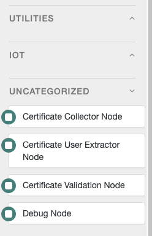

## ForgeRock Configuration

1. Log into the ForgeRock AM console
2. Select the appropriate `Realm`
3. Click `Authentication Trees`
4. Click `Create Tree` and create a new Authentication Tree as shown in section <a href="#Example-Flow">_Example Flow_</a>
5. Click the `Certificate Collector Node` and configure the `Certificate Collection Method` as shown

   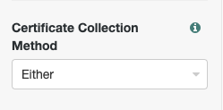

6. Click the `Certificate Validation Node` and configure below options

   6.1. Enable the `Check Certificate Expiration` option

     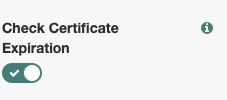
   
   6.2. Enable the `Match Certificate to CRL` option

     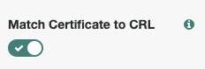

   6.3. Enable the `Cache CRLs in Memory` option

     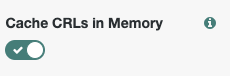

   6.4. Enable the `Update CA CRLs from CRLDistributionPoint` option

    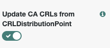

   6.5. Add `LDAP Server Where Certificates are Stored`

    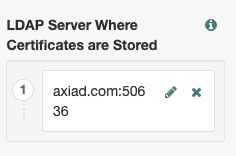

   6.6. Configure the `LDAP Server Authentication Password`

    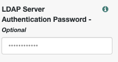

   6.7. Enable the `Use SSL/TLS for LDAP Access` option

    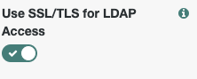

5. Click the `Certificate User Extractor Node` and configure the `SubjectAltNameExt Value Type to Access User Profile` as shown

    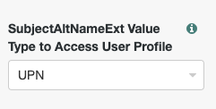
   
6. Click `save`
   
## Example Flow

 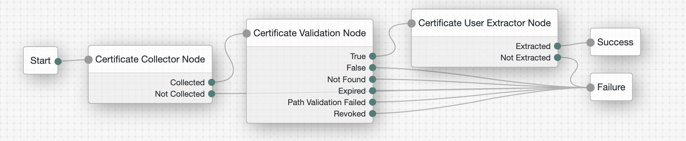
